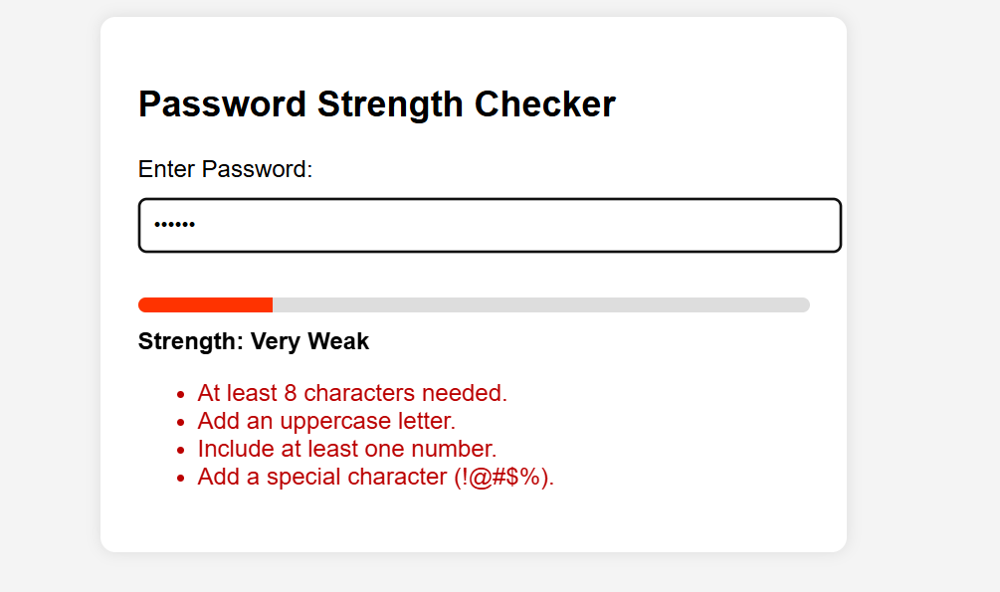
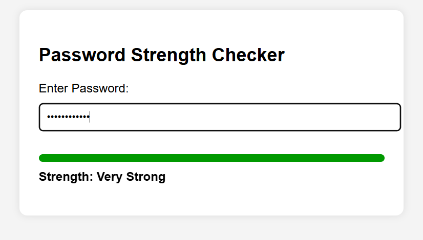

# PRODIGY_CS_03
# Password Strength Checker Web App

A simple and interactive Password Strength Checker built using Flask, HTML, CSS, and JavaScript.
The app evaluates password strength in real-time based on:

Length

Uppercase letters

Lowercase letters

Digits

Special characters

Color-coded strength meter

Dynamic feedback suggestions

### Features
- Real-Time Password Strength Evaluation

 Instant feedback as the user types — no need to submit a form.

-  Strength Meter Visualization

- color-coded bar that grows from red → green depending on password strength.

- User-Friendly Interface

Simple, clean, and responsive UI using minimal CSS.

- Flask Backend

- Serves the HTML page and can be extended for backend validation or database integration.

## Project Structure
```bash
 PRODIGY_CS_03/
 │
 ├── app.py
 └── templates/
     └── index.html
```
🛠️ Installation & Setup
1. Clone the repository (or download ZIP)
    ```bash
        git clone https://github.com/yourusername/PRODIGY_CS_03.git
        cd PRODIGY_CS_03
    ```
2. Create a virtual environment (optional but recommended)
    ```bash
        python3 -m venv venv
        source venv/bin/activate      # macOS / Linux
        venv\Scripts\activate         # Windows

3. Install dependencies
```bash
pip install flask
```
4. Run the application
```
python app.py
```
6. Open your browser and visit:
http://127.0.0.1:5000

### How It Works

The JavaScript function evaluates the password based on:

Length >= 8

Contains uppercase characters

Contains lowercase characters

Contains digits

Contains special characters

Each criterion adds to the score (0–5).
The strength meter visually reflects this score, and feedback messages guide the user to improve the password.




### Future Enhancements

- Add backend validation via Flask API

- Add password visibility toggle

- Add zxcvbn library for smarter password scoring

- Add dark mode

- Deploy on Render / Vercel / Heroku
